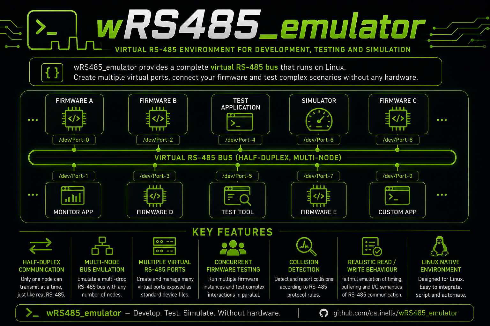

# wRS485_emulator - RS485 BUS emulator for test and development environment 

## 1.0 Files

|   Files/Dirs  |                     Description                           |
|---------------|-----------------------------------------------------------|
| images        | This folder contains picture used by the README.md files  |
| LICENSE       | GPL 3 license                                             |
| Changes.md    | Main changes of every released version                    |
| TODO.md       | Features to implement in the next versions                |
| src           | C source code                                             |
| tools         | External sub-modules (eg. winstall)                       |

## 2.0 Description

I wrote this code in 2022 when I was working for Fimer (Tuscany - Italy), because I needed an emulator to write a modbus
daemon. When I finished to develop wRS485_emulator it allowed me to write many different virtual serial fake-devices to
analyze the behavior of my daemon in many situations. From the point of view of the devices, the emulation is completely transparent:
they still configure a serial port, open it, send data, receive a reply, and close that port, at the end of their process.

## 2.1 RS485 port roles
As in the concrete RS485 communications, this virtual bus accepts one single master device. But, in the emulation environment, it
means a unique master-port. About the slave-devices, the wRS485_emulator can accept many virtual-devices connected in the same
time.

	+--------------+
	|              |          +-------------------------------------------------------+
	| RS485 master |          |                      RS485 Emulator                   |
	|   software   |          +----+-------------------+--+--+--+--+------------------+
	|              |               |                   |  |  |  |  |
	+------+-------+               |   +---------------+  |  |  |  +---------------+
	       |         +-------------+   |                  |  |  |                  |
	       |         |                 |          +-------+  |  +-------+          |
	       |    +----+---+             |          |          |          |          |
	       +--->| Master |         +---+---+  +---+---+  +---+---+  +---+---+  +---+---+
	            |  port  |         | slave |  | slave |  | slave |  | slave |  | slave | 
	            +--------+         | port  |  | port  |  | port  |  | port  |  | port  | 
	                               +---+---+  +---+---+  +---+---+  +---+---+  +---+---+
	                                   |          |          |          |          |
	                                   |          |          |          |          |
	                                +--+---+   +--+---+   +--+---+   +--+---+   +--+---+
	                                | DEV1 |   | DEV2 |   | DEV3 |   | DEV4 |   | DEVn |  
	                                +------+   +------+   +------+   +------+   +------+

### 2.2 Build the source code
In order to build the software you need the SQLite3 library and SOCAT tool. Using Debian-OS you have to install the following DEB packages:

- build-essential 
- libsqlite3
- libsqlite3-dev
- socat

For the next step enter in the <project>/src sub folder and type the following command:
	
	make all

If you want to install just the binary files, you can use the following command

	[PREFIX=<folder>] make install

## 3.0 How to install wRS485_emulator software
In order to avoid to create the common INSTALL script to install and remove minute software, I have created the winstall
sub-module. It allows you to install and remove the package in easy way. The **winstall.sh** file should be located in the
tools/winstall folder. If the folder is missing, then you have to clone the sub-module with the following command:

	git submodule update --init --recursive

When you have downloaded the sub-module, you can install wRS485_emulator with the following command:

	sudo ./tools/winstall/winstall.sh --cmd=install --verbose

For further information on this tool, please, read the [winstall project's page](https://github.com/catinella/winstall)

## 3.0 TODO
[TODO](TODO.md)

## 4.0 Changes
[CHANGES](Changes.md)

## 5.0 Licence:
This project is a free software; you can redistribute it and/or modify it under the terms	of the GNU General Public License
as published by the Free Software Foundation; either version 3.0 of the License, or (at your option) any later version. 

For further details please read the full [GPL3 text file](LICENSE.md).
You should find a copy of the GNU General Public License document in the root folder of the project; if not, write to the 

	Free Software Foundation, Inc.,
	59 Temple Place, Suite 330,
	Boston, MA  02111-1307  USA
